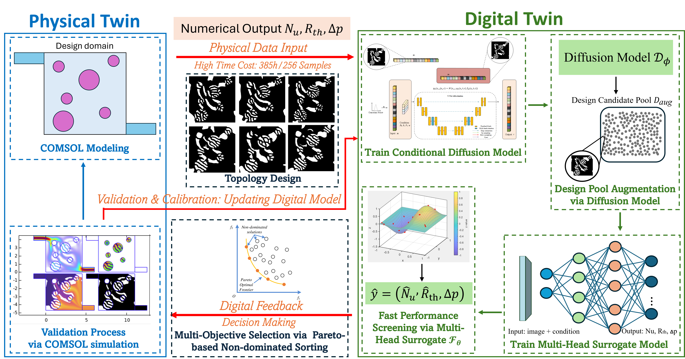

# Cold-Plates-Design-with-Diffusion-Model
Optimization of Cold Plates with Asymmetric Heat Sources via a Diffusion-Model–Driven Digital Twin

# Overview

## Multiphysics simulation and Topology Optimization Dataset

# 📄 Citation
If you use this code, please cite:
